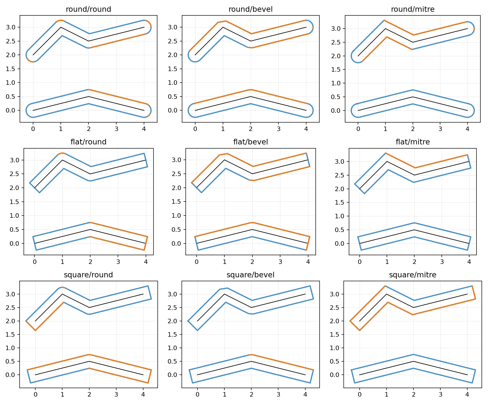
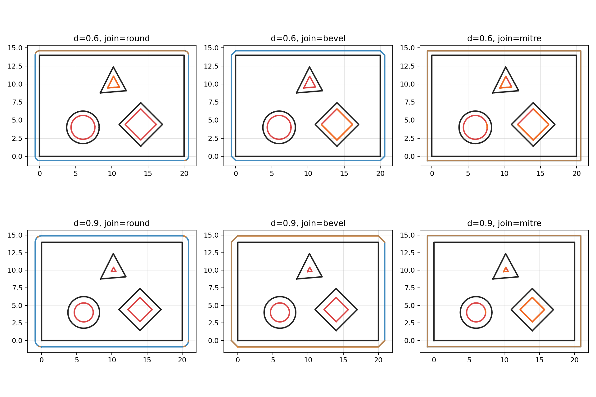

 # shapely-mojo
 
 Mojo-native, minimal Shapely-like geometry library and algorithms.
 
 ## Requirements
 
 - Mojo toolchain available on your PATH (`mojo`)
 - Python 3.13+
 - `uv`
 
 ## Setup
 
 Create / sync the virtualenv with dependencies:
 
 ```bash
 uv sync
 ```
 
 ## Run the Mojo tests
 
 ```bash
 uv run mojo run -I shapely_mojo shapely_mojo/tests/run_tests.mojo
 ```
 
 ## Run the buffering + matplotlib example
 
 This example:
 
 - creates a couple of `LineString`s
 - buffers them using **Mojo Shapely** (`shapely.constructive.buffer`)
 - plots the input lines + buffer result using `matplotlib` via Mojo Python-interop
 - writes the image to `outputs/line_buffer.png`
 
```bash
uv run mojo run -I shapely_mojo examples/plot_line_buffer.mojo
```
 
The output directory is created automatically.

## Images

Line buffer cap/join style comparison (generated by `examples/plot_line_buffer.mojo`):



Polygon buffering with holes (shows `buffer` for `join_style` = round/bevel/mitre at distances `d=0.6` and `d=0.9`, including how interior holes shrink/round under each join style):



Regenerate:

```bash
uv run mojo run -I shapely_mojo examples/plot_polygon_buffer_with_holes.mojo
```

## Project layout
 
- `shapely_mojo/shapely/`
  - Mojo implementation of geometry types and operations
- `shapely_mojo/tests/run_tests.mojo`
  - Small Mojo test runner
- `examples/`
  - Runnable examples (Mojo)
- `outputs/`
  - Generated images/artifacts (not tracked)
